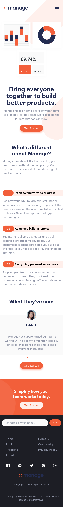

This is a solution to the [Manage landing page challenge on Frontend Mentor](https://www.frontendmentor.io/challenges/manage-landing-page-SLXqC6P5). Frontend Mentor challenges help you improve your coding skills by building realistic projects. 

## Table of contents

- [Overview](#overview)
  - [The challenge](#the-challenge)
  - [Screenshot](#screenshot)
  - [Links](#links)
- [My process](#my-process)
  - [Built with](#built-with)
  - [What I learned](#what-i-learned)
  - [Continued development](#continued-development)
  - [Useful resources](#useful-resources)
- [Author](#author)

## Overview
An upcoming web developer stumbled upon this challenge on youtube and decided to do it on his own without following any instruction. Well he is done.

### The challenge

Users should be able to:

- View the optimal layout for the site depending on their device's screen size
- See hover states for all interactive elements on the page
- See all testimonials in a horizontal slider
- Receive an error message when the newsletter sign up `form` is submitted if:
  - The `input` field is empty
  - The email address is not formatted correctly

### Screenshot

For Desktop Screen

For Mobile Screen

### Links

- Solution URL: [Git hub](https://github.com/Jamieeee1/manage-landing-page-master)
- Live Site URL: [Vercel on a server](https://manage-landing-page-master-gamma.vercel.app/)

## My process
- started with installing tailwindcss
- then built the html
- configures tailwind css
- then css
- imported swipperjs
- then css again
- then javascript

### Built with

- Semantic HTML5 markup
- TailwindCSS custom properties
- Flexbox
- CSS Grid
- [Tailwindcssv3](https://v3.tailwindcss.com/docs) - Tailwindcss
- [swipperjs](https://swiperjs.com/) - Swiper JS

### What I learned
Used this as a learning space for tailwind. Do I love the experience? Yes, Did it frustrate me? Yessss. At some point I contemplated stopping the project.

### Continued development

I do want to improve on tmy Java script knowledge. 

### Useful resources

- [MDN web docs](https://developer.mozilla.org/en-US/docs/Web/) -This help me to understand css even more .

## Author

- Website - [Github](https://github.com/Jamieeee1)
- Frontend Mentor - [@Jamieeee1](https://www.frontendmentor.io/profile/Jamieeee1)
- Twitter - [@meet_jamesb](https://x.com/meet_jamesb)

